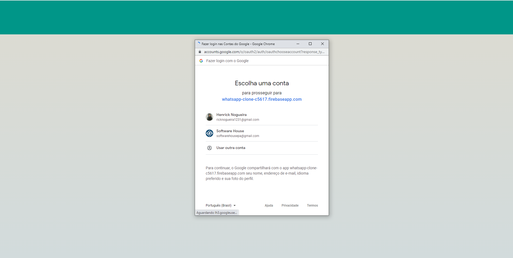
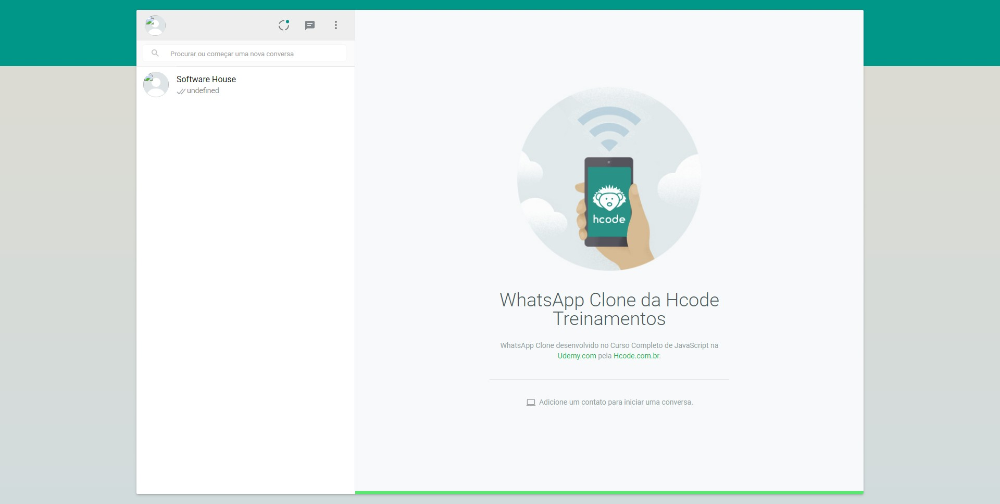
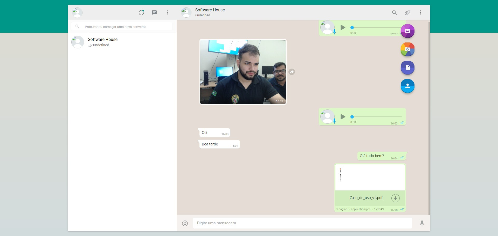
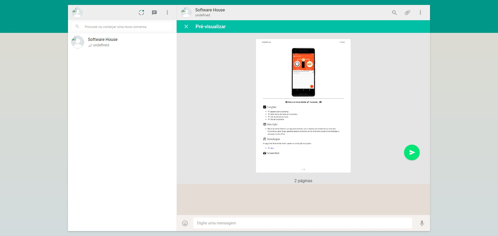
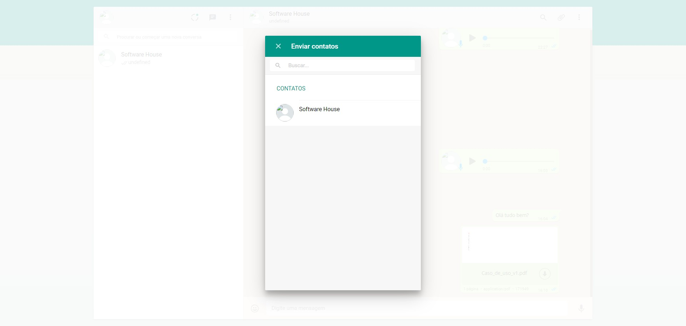

<h4 align="center"> 
	🚧 WhatsApp Web Clone 🚀 Concluido...  🚧
</h4>

Projeto desenvolvido como exemplo do Curso Completo de JavaScript na Udemy.com.

## ✅ Funções

- [x] Envio de mensagem em tempo real
- [x] Envio de Emojis
- [x] Enviar fotos do computador
- [x] Tirar fotos com a webcam
- [x] Enviar Documentos
- [x] Enviar Audio
- [x] Enviar contatos
- [x] Editar Perfil
- [x] Fazer login com o login do google   
- [x] Notificação de mensagem

## 🛠 Tecnologias

As seguintes ferramentas foram usadas na construção do projeto:

-  [JavaScript](https://developer.mozilla.org/pt-BR/docs/Web/JavaScript)
-  [HTML5](https://developer.mozilla.org/pt-BR/docs/Web/HTML)

## 🖥️ Plataforma adotada

  - WEB

## 📸 Screenshot








## Project setup
```
npm install
```

### Compiles and hot-reloads for development
```
npm start
```

### Compiles and minifies for production
```
npm run build
```

### Run your tests
```
npm run test
```

### Lints and fixes files
```
npm run lint
```

### Recursos Usados

Lista de recursos usados em aula para este projeto

| Recurso | Link |
| ------ | ------ |
| Webpack | https://webpack.js.org/ |
| Firebase Authentication | https://firebase.google.com/docs/auth/?authuser=0 |
| Cloud Firestore | https://firebase.google.com/docs/firestore/?authuser=0 |
| Cloud Functions | https://firebase.google.com/docs/functions/?hl=pt-br |
| Cloud Storage | https://firebase.google.com/docs/storage/?authuser=0 |
| PDF.js | https://mozilla.github.io/pdf.js/ |
| MediaDevices.getUserMedia() | https://developer.mozilla.org/en-US/docs/Web/API/MediaDevices/getUserMedia |